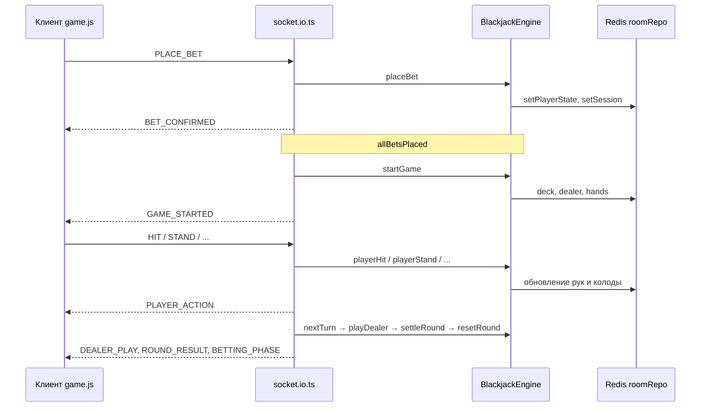

# Socket.IO в проекте BlackJack

Документ для разбора цепочки вызовов: от подключения клиента до изменений в Redis и обратно к браузеру.

> **Хранилище комнат:** членство в комнате и игровое состояние лежат в **Redis**, не в PostgreSQL. PG используется для пользователей и баланса (синхронизация после раунда).

---

## 1. Как подключается Socket.IO

### 1.1. HTTP-сервер и экземпляр `Server`

```9:15:src/server/server.ts
const server = http.createServer(app);

const socketio = new Server(server, {cors:{
    origin: ["http://127.0.0.1:8888","*"],
    methods: ["GET", "POST"]
}});
```

`Server` из `socket.io` вешается на тот же `http.Server`, что и Express.

### 1.2. Регистрация обработчиков

```1:3:src/index.ts
import {server} from "./server/server.js";
import redisClient from "./database/redis.js";
import "./socket.io/socket.io.js"; // регистрируем все socket.io обработчики
```

Импорт `socket.io.ts` **side-effect**: вешает `io.use(...)`, `io.on("connection", ...)`.  
Старый пустой `socketio.on("connection")` в `server.ts` (строки 17–24) по сути дублируется и не содержит игровой логики.

### 1.3. Клиент на странице комнаты

```9:22:public/js/game.js
const socket = io({ transports: ["websocket"] });
const roomId = document.body.dataset.roomId;

socket.on("connect", () => {
    console.log("[socket] connected:", socket.id);
    socket.emit("ROOM_JOIN", { roomId });
});
```

После TCP/WebSocket-подключения клиент шлёт `ROOM_JOIN` с `roomId` из `data-room-id` на `<body>`.

---

## 2. Аутентификация сокета

### 2.1. Глобальный middleware `authenticateSocket`

Вызывается **один раз** при установке соединения, до `connection`.

```13:35:src/socket.io/socket.middleware.ts
export const authenticateSocket = async (
    socket: SocketWithData,
    next: (err?: Error) => void
) => {
    const cookies      = cookie.parse(socket.handshake.headers.cookie || "");
    const sessionToken = cookies["sessionToken"];

    if (!sessionToken) {
        socket.emit("SESSION_INVALID");
        return next(new Error("Not authenticated"));
    }

    const session = await userSessionService.getUserSessionByToken(sessionToken);
    if (!session) {
        socket.emit("SESSION_INVALID");
        return next(new Error("Session invalid or expired"));
    }

    socket.data.userSession  = session;
    socket.data.sessionToken = sessionToken;
    socket.data.currentRoomId = null;

    next();
};
```

**Цепочка:**

| Метод | Файл | Назначение |
|--------|------|----------|
| `cookie.parse` | `cookie` | Разбор заголовка `Cookie` |
| `getUserSessionByToken` | `userSession.service` → Redis | Проверка сессии |
| `socket.data.*` | Socket.IO | Данные на всё время жизни сокета |

Подключение в `socket.io.ts`:

```15:16:src/socket.io/socket.io.ts
io.use(authenticateSocket as any);
```

### 2.2. `guardSession` — перед каждым событием

```42:60:src/socket.io/socket.middleware.ts
export const guardSession = async (
    socket: SocketWithData,
    next: (err?: Error) => void
) => {
    const token = socket.data.sessionToken;
    if (!token) {
        socket.emit("SESSION_INVALID");
        socket.disconnect();
        return;
    }
    const session = await userSessionService.getUserSessionByToken(token);
    if (!session) {
        socket.emit("SESSION_INVALID");
        socket.disconnect();
        return;
    }
    socket.data.userSession = session;
    next();
};
```

Регистрация внутри `connection`:

```61:64:src/socket.io/socket.io.ts
    socket.use(async ([event, ...args], next) => {
        await guardSession(socket as any, next);
    });
```

---

## 3. События: клиент → сервер

Типы событий:

```65:76:src/socket.io/socket.types.ts
export interface ClientToServerEvents {
    ROOM_JOIN:      (data: { roomId: string }) => void;
    ROOM_LEAVE:     () => void;
    PLACE_BET:      (data: { roomId: string; amount: number }) => void;
    HIT:            (data: { roomId: string }) => void;
    STAND:          (data: { roomId: string }) => void;
    DOUBLE:         (data: { roomId: string }) => void;
    SPLIT:          (data: { roomId: string }) => void;
    SURRENDER:      (data: { roomId: string }) => void;
    CHAT_MESSAGE:   (data: { roomId: string; text: string }) => void;
    GET_ROOM_STATE: (data: { roomId: string }) => void;
}
```

### 3.1. `ROOM_JOIN` — войти в socket-комнату

```69:96:src/socket.io/socket.io.ts
    socket.on("ROOM_JOIN", async ({ roomId }) => {
        const users = await roomService.getAllUsersFromRoom(roomId);
        if (!users.includes(String(userSession.userId))) {
            socket.emit("ERROR", { code: "NOT_IN_ROOM", message: "Вы не в этой комнате" });
            return;
        }
        if (socket.data.currentRoomId && socket.data.currentRoomId !== roomId) {
            socket.leave(socket.data.currentRoomId);
        }
        await socket.join(roomId);
        socket.data.currentRoomId = roomId;
        const state = await engine.buildRoomState(roomId);
        socket.emit("ROOM_STATE", state);
        socket.to(roomId).emit("PLAYER_JOINED", { userId, name });
    });
```

| Метод | Слой | Что делает |
|--------|------|------------|
| `getAllUsersFromRoom` | `roomService` → `roomRedisRepository` | `SMEMBERS room:users:{roomId}` |
| `socket.join(roomId)` | Socket.IO | Подписка на broadcast в комнату |
| `buildRoomState` | `BlackjackEngine` | Собирает `RoomState` из Redis |
| `socket.emit` | Socket.IO | Только этому клиенту |
| `socket.to(roomId).emit` | Socket.IO | Всем в комнате, кроме отправителя |

**Важно:** `ROOM_JOIN` не добавляет игрока в Redis. В Redis пользователь попадает через HTTP `PUT /api/lobby/room/:roomId` (`addUserToRoom`).

### 3.2. `PLACE_BET` — ставка и старт раунда

```118:146:src/socket.io/socket.io.ts
    socket.on("PLACE_BET", async ({ roomId, amount }) => {
        const result = await engine.placeBet(roomId, userSession.userId, amount);
        // ...
        socket.emit("BET_CONFIRMED", { balance: result.newBalance });
        if (result.allBetsPlaced) {
            const gameState = await engine.startGame(roomId);
            io.to(roomId).emit("GAME_STARTED", gameState);
            // возможен автоматический handleNextTurn(...)
        }
    });
```

**`engine.placeBet`** (упрощённо):

- `roomRepo.getRoomGame` — статус `BETTING`
- `userSessionRepo.getSessionByUserId` / `getUserSessionByToken` — баланс
- `roomRepo.setPlayerState` — рука со ставкой
- `userSessionRepo.setSession` — списание баланса
- `roomRepo.getAllPlayersStates` — все ли поставили

**`engine.startGame`:**

- колода, раздача, `setRoomGameFields`, `setPlayerState`
- возвращает `RoomState` для клиентов

### 3.3. Игровые действия (`HIT`, `STAND`, `DOUBLE`, `SPLIT`, `SURRENDER`)

Общий паттерн:

1. `engine.playerXxx(roomId, userId)` — проверки + Redis
2. `io.to(roomId).emit("PLAYER_ACTION", ...)` — обновление UI у всех
3. Для `STAND` / `DOUBLE` / `SURRENDER` / `BUST` после `HIT` → `handleNextTurn`

Пример `HIT`:

```150:171:src/socket.io/socket.io.ts
    socket.on("HIT", async ({ roomId }) => {
        const result = await engine.playerHit(roomId, userSession.userId);
        io.to(roomId).emit("PLAYER_ACTION", { ... });
        if (currentHand?.status === "BUST") {
            await handleNextTurn(roomId, userSession.userId);
        }
    });
```

**`engine.playerHit`:**

- `getRoomGame` — `PLAYING`, `currentPlayer === userId`
- `getPlayerState` / `setPlayerState`
- `popCard` — карта из колоды в Redis
- `countHand` — перебор → `hand_status.BUST`

### 3.4. `handleNextTurn` — смена хода и конец раунда

```19:53:src/socket.io/socket.io.ts
async function handleNextTurn(roomId: string, userId: number) {
    const turn = await engine.nextTurn(roomId, userId);

    if ("nextUserId" in turn) {
        io.to(roomId).emit("TURN_CHANGED", { userId: turn.nextUserId });
        return;
    }

    if ("dealerPlaying" in turn) {
        const dealerResult = await engine.playDealer(roomId);
        io.to(roomId).emit("DEALER_PLAY", dealerResult);
        const settle = await engine.settleRound(roomId);
        io.to(roomId).emit("ROUND_RESULT", { ... });
        await engine.resetRound(roomId);
        setTimeout(() => io.to(roomId).emit("BETTING_PHASE", {}), 3000);
    }
}
```

**`engine.nextTurn`:**

- следующая рука при сплите (`setPlayerState`, `current_hand_index`)
- или следующий игрок в `player_order`
- или `{ dealerPlaying: true }`

**`engine.playDealer`:** тянет до 17+, пишет `dealer` и `deck` в Redis.

**`engine.settleRound`:** исходы рук, выплаты в сессию, опционально `userPGRepo.updateBalance`.

**`engine.resetRound`:** очистка рук игроков, `dealer: []`, `status: BETTING`.

---

## 4. Выход из комнаты и `disconnect`

### 4.1. Обработчики на сервере

```99:107:src/socket.io/socket.io.ts
    socket.on("ROOM_LEAVE", async () => {
        await handleLeave(socket);
    });

    socket.on("disconnect", async () => {
        await handleLeave(socket, true);
    });
```

### 4.2. `handleLeave`

```272:294:src/socket.io/socket.io.ts
async function handleLeave(socket, isDisconnect = false) {
    const { userSession, currentRoomId } = socket.data;
    if (!userSession || !currentRoomId) return;

    try {
        await engine.forfeitPlayer(currentRoomId, userSession.userId);
        const game = await roomRepo.getRoomGame(currentRoomId);
        if (game?.currentPlayer === userSession.userId) {
            await handleNextTurn(currentRoomId, userSession.userId);
        }
    } catch { /* ... */ }

    socket.to(currentRoomId).emit("PLAYER_LEFT", { userId: userSession.userId });

    if (!isDisconnect) {
        socket.leave(currentRoomId);
        socket.data.currentRoomId = null;
    }
}
```

**`engine.forfeitPlayer`:**

```616:622:src/game/BlackjackEngine.ts
    forfeitPlayer = async (roomId: string, userId: number) => {
        const ps = await roomRepo.getPlayerState(roomId, userId);
        if (!ps) return;
        for (const hand of ps.hands) {
            if (!isHandDone(hand)) hand.status = hand_status.STOOD;
        }
        await roomRepo.setPlayerState(roomId, userId, ps.hands, ps.currentHandIndex);
    };
```

### 4.3. Полный выход из Redis (HTTP)

При уходе через шапку (`roomHeaderScript` → API):

```69:81:src/express/api/controllers/room.api.controller.ts
    leaveRoom = async (req, res) => {
        const userId = req.userSession?.userId;
        const roomId = await roomService.removeUserFromCurrentRoom(userId);
        // ...
    }
```

```154:158:src/express/repositories/room.redis.repository.ts
    removeUserFromCurrentRoom = async (userId: number) => {
        const roomId = await RedisClient.get(PREFIXES.userIdRoom(userId));
        if (!roomId) return null;
        await this.removeUserFromRoom(roomId, userId);
        return roomId;
    };
```

`removeUserFromRoom` удаляет:

- `user:id:room:{userId}`
- пользователя из `room:users:{roomId}`
- хеш `room:player:{roomId}:user:{userId}`

При **logout** то же самое вызывается из `authorization.api.controller` → `kickFromRoom` → `removeUserFromCurrentRoom`.

---

## 5. Ответ: отключение при потере Socket.IO

### Кратко: **из Redis-комнаты при `disconnect` игрок не удаляется.**

| Действие | Redis (членство в комнате) | Игровое состояние | Уведомление других |
|----------|----------------------------|-------------------|---------------------|
| `disconnect` / обрыв сети | **Нет** — ключи `user:id:room`, `room:users` остаются | Да — `forfeitPlayer` (руки → STOOD), возможен `handleNextTurn` | Да — `PLAYER_LEFT` |
| `ROOM_LEAVE` (сокет) | **Нет** | То же | Да |
| `PUT /api/lobby/room/leave` | **Да** — `removeUserFromCurrentRoom` | Не трогает явно | Нет (это HTTP) |
| Logout API | **Да** + `disconnect` сокетов | — | `FORCE_DISCONNECT` |

**Следствия:**

1. После обрыва соединения игрок **числится в комнате** в Redis и может снова зайти на `/lobby/room/:id` (HTTP middleware пропустит).
2. Другие видят `PLAYER_LEFT`, но в `buildRoomState` отключившийся всё ещё может отображаться как участник.
3. PostgreSQL тут ни при чём: комнаты только в Redis.

**Клиент при обрыве** только показывает уведомление, выход из Redis не инициирует:

```24:27:public/js/game.js
socket.on("disconnect", () => {
    console.log("[socket] disconnected");
    showNotification("Соединение потеряно", "error");
});
```

**Что обычно добавляют:** в `handleLeave` при `isDisconnect === true` вызывать `roomService.removeUserFromCurrentRoom(userSession.userId)` (и при необходимости удалять пустую комнату).

---

## 6. События: сервер → клиент

```78:94:src/socket.io/socket.types.ts
export interface ServerToClientEvents {
    ROOM_STATE:        (data: RoomState) => void;
    PLAYER_JOINED:     ...
    PLAYER_LEFT:       ...
    GAME_STARTED:      (data: RoomState) => void;
    PLAYER_ACTION:     (data: PlayerActionEvent) => void;
    TURN_CHANGED:      (data: { userId: number }) => void;
    DEALER_PLAY:       ...
    ROUND_RESULT:      ...
    BETTING_PHASE:     ...
    ...
}
```

Обработка в `public/js/game.js`: `renderFullState`, `renderPlayerHands`, `renderRoundResults`, `updateControls`, и т.д.

---

## 7. Схема одного раунда



---

## 8. Файлы для чтения по порядку

1. `src/index.ts` — подключение модуля сокетов  
2. `src/server/server.ts` — `Server` на HTTP  
3. `src/socket.io/socket.middleware.ts` — auth  
4. `src/socket.io/socket.types.ts` — контракт событий  
5. `src/socket.io/socket.io.ts` — все обработчики  
6. `src/game/BlackjackEngine.ts` — игровая логика и Redis  
7. `src/express/repositories/room.redis.repository.ts` — ключи Redis  
8. `public/js/game.js` — клиент  

---

## 9. Redis-ключи комнаты (справка)

| Ключ | Назначение |
|------|------------|
| `room:users:{roomId}` | Set userId в комнате |
| `user:id:room:{userId}` | В какой комнате пользователь |
| `room:player:{roomId}:user:{userId}` | `hands`, `current_hand_index` |
| `room:game:{roomId}` | `deck`, `dealer`, `status`, `current_player`, `player_order` |
| `room:meta:{roomId}` | название, лимиты, `deck_count` |
